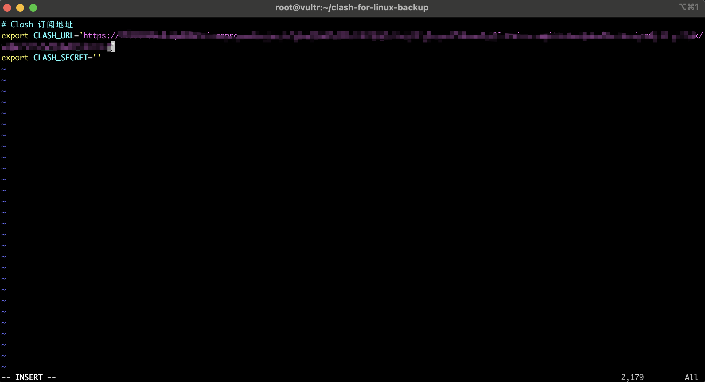

# 前言

继之前的[项目](https://github.com/zhaoweih/Clash-Copy)收录了clash的mac windows ios android客户端后，有很多老哥给我发邮件反馈需要linux版本的，因为在一些国内的服务器需要科学上网去拉取一些开发需要用到的库，或者访问一些被限制的服务例如openai之类的需要用到linux的版本。今天趁着有空把linux也收录下。

# 使用指南

首先先在我们的服务器执行下面的命令查看ip和地区，用于后面对比：
```bash
curl ip.im/info
```

一般我们的服务器如果在国内是会打印下面的信息
```bash

stanleyzhao@StanleydeMacBook-Pro Github % curl ip.im/info
----------------------------------------
  _____   _____        _____   __  __
 |_   _| |  __ \      |_   _| |  \/  |
   | |   | |__) |       | |   | \  / |
   | |   |  ___/        | |   | |\/| |
  _| |_  | |       _   _| |_  | |  | |
 |_____| |_|      (_) |_____| |_|  |_|
----------------------------------------

  	CountryCode:CN
	Ip:120.xx.xx.xx
	Country:中国
	Province:广东
	City:深圳
	Districts:福田区
	Isp:中国移动
	ASN:xxxx

----------------------------------------
```

# 开始

## 1.克隆项目

```bash
https://github.com/zhaoweih/clash-for-linux-backup.git
```

## 2.进入项目修改.env文件 添加clash订阅地址

输入下面的命令编辑`.env`文件 修改`CLASH_URL`的值为你的订阅地址

```bash
cd clash-for-linux-backup
vim .env
```
Tips:vim编辑键盘按下`i`，修改完成后先按下键盘`esc`退出编辑模式，然后按下`:wq` 保存并退出就行，如下图




## 3.启动clash

在当前目录下运行start.sh脚本
```bash
sudo bash start.sh
```
等待服务启动成功，记得把成功后生成的Secret记下来


接着执行下面的命令开启服务：
```bash
source /etc/profile.d/clash.sh
proxy_on
```


## 4.进入clash控制台选择配置

访问clash控制台地址：
http://替换成你的ip:9090/ui

例如你的服务器ip是8.8.8.8，则访问http://8.8.8.8:9090/ui

下面以你的ip是8.8.8.8举例，请记得替换成你对应的ip地址

接着在`API Base URL`一栏中输入上面的地址例如：http://8.8.8.8:9090/ui ，在`Secret(optional)`一栏中输入上面保存的Secret。

点击`Add`并选择刚刚输入的管理界面地址http://8.8.8.8:9090/ui ，之后便可在浏览器上进行一些配置。如下图


成功进入控制台

### 先在左边栏Proxies选择你需要的节点


### 接着在Config里开启Global模式


接着再在终端执行命令：

```bash
curl ip.im/info
```

看看ip和地区是不是变了
这时候的ip正常的话是会变成你的节点的ip了，这时候就可以愉快的享受互联网了


